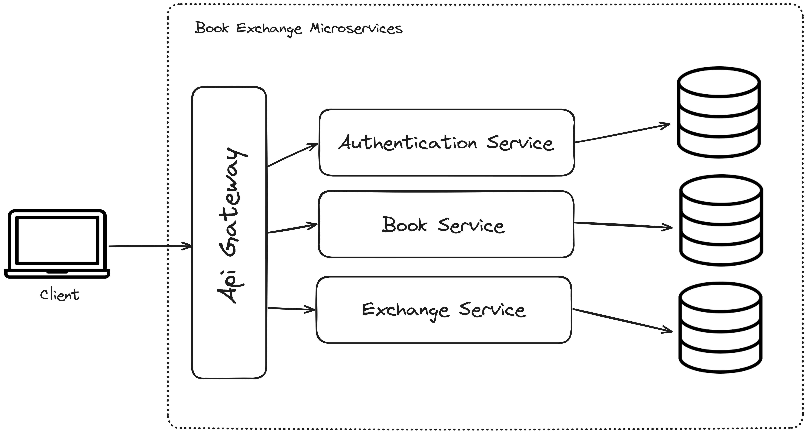
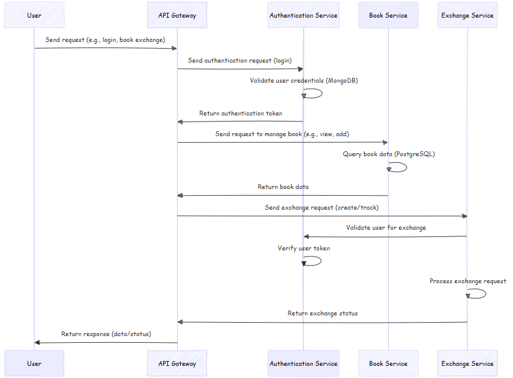
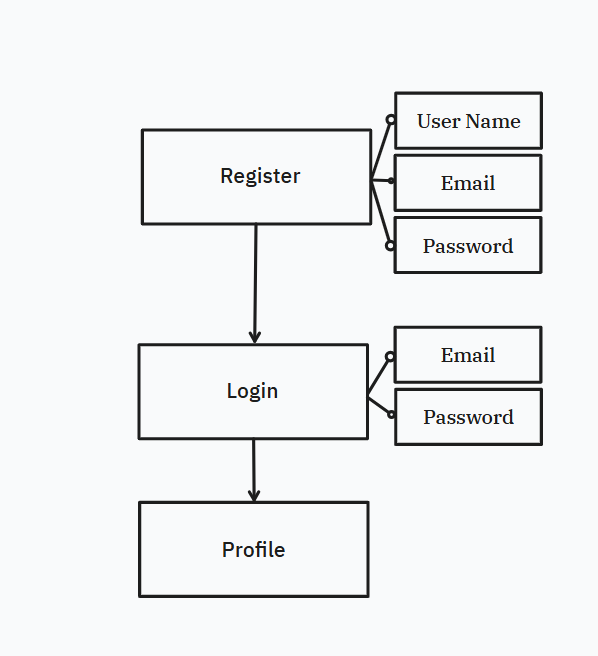
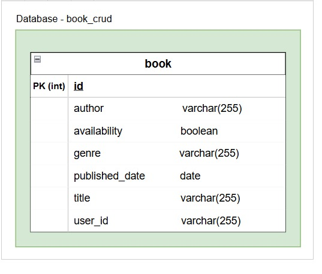
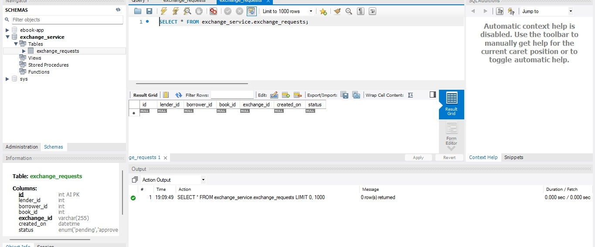
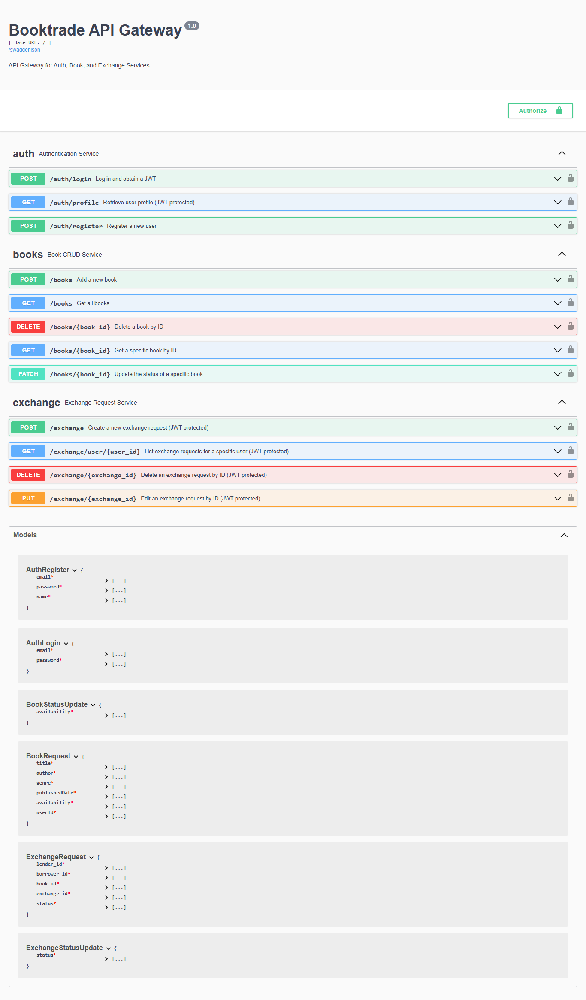

# Microservices Architecture Documentation for Book Exchange Platform

---

## Table of Contents
1. [Introduction](#1-introduction)
2. [Architecture Overview](#2-architecture-overview)
3. [Service Descriptions](#3-service-descriptions)
   - 3.1 [Authentication Service](#31-authentication-service)
   - 3.2 [Book Service](#32-book-service)
   - 3.3 [Exchange Service](#33-exchange-service)
   - 3.4 [API Gateway](#34-api-gateway)
4. [System Requirements](#4-system-requirements)
5. [Service Communication Flow](#5-service-communication-flow)
6. [Port Configuration](#6-port-configuration)
7. [Database Pattern](#7-database-pattern)
   - 7.1 [Auth Service Database Pattern](#71-auth-service-database-pattern)
   - 7.2 [Book Service Database Pattern](#72-book-service-database-pattern)
   - 7.3 [Exchange Service Database Pattern](#73-exchange-service-database-pattern)
8. [Endpoint Overview](#8-endpoints-overview)
9. [Testing using Swagger](#9-testing-with-swagger)
10. [Error Handling & Logging](#10-error-handling--logging)

---

### 1. Introduction
The Book Exchange Platform is designed as a digital hub that facilitates the lending, borrowing, and exchanging of books between users. By connecting book enthusiasts within a single platform, it promotes sustainable book sharing and community-driven engagement, making books more accessible to everyone.

To create a scalable, flexible, and maintainable platform, we adopted a microservices architecture. This approach segments core functionalities—such as user authentication, book management, and exchange handling—into independent services. Each service is isolated by functionality, allowing it to be developed, deployed, and scaled independently. An API Gateway is employed to provide a unified entry point for all client requests, ensuring that users have a seamless experience interacting with the platform.

The architecture of the Book Exchange Platform is synchronous, with services communicating via HTTP requests. This setup allows for straightforward implementation of business logic without requiring a message broker, making it simpler to manage and deploy. The Authentication Service plays a central role, securing the platform by validating user credentials and tokens for each request.

This document outlines the components of the microservices architecture for the Book Exchange Platform, detailing the responsibilities of each service, the API Gateway configuration, the communication flow, and the strategies implemented for error handling, logging, and security. By adopting this architecture, the platform is well-positioned to handle evolving requirements and increasing demand as the user base grows.

---

### 2. Architecture Overview

The Book Exchange Platform leverages a microservices architecture, where each core functionality—user authentication, book management, and exchange handling—operates independently in its own service. This modular design promotes scalability, maintainability, and separation of concerns, enabling each service to evolve independently.

The architecture consists of the following components:

- **Authentication Service** (Node.js + Express + MongoDB, Port: 3001): This service handles user authentication tasks such as login, registration, and token validation. Built with Node.js and Express, it uses MongoDB as its database to store and manage user data efficiently. MongoDB's flexibility with JSON-like documents allows quick scaling and adjustments to user data, supporting a diverse range of attributes needed for user profiles and authentication.

- **Book Service** (Java + Spring Boot + PostgreSQL, Port: 3002): Developed in Java with Spring Boot, this service manages book-related functionalities like adding, updating, retrieving, and deleting book records. The service utilizes PostgreSQL as its relational database to ensure data integrity and support complex queries on book listings. PostgreSQL’s robustness is ideal for handling structured data like book details, categories, and user interactions related to books.

- **Exchange Service** (Node.js + Express + Sequelize + Postgres, Port: 3003): This service handles book exchange processes, allowing users to initiate, accept, and manage exchange requests. It verifies user identity and manages exchange statuses, ensuring secure and accurate transactions. It relies on the Authentication Service for user verification before processing requests.

- **API Gateway** (Flask + Swagger, Port: 3000): The API Gateway, built with Flask and integrated with Swagger for API documentation, acts as the single entry point for all client requests. It routes incoming traffic to the appropriate microservices (Authentication, Book, or Exchange) and aggregates responses, ensuring a consistent and user-friendly API experience for clients.

**Communication Flow:**  
All services communicate synchronously via HTTP requests, with the API Gateway routing each request to the appropriate service. When authentication is required, services first interact with the Authentication Service to validate user tokens. After successful validation, the requested service processes the business logic. This synchronous communication model ensures simplicity while maintaining security and consistency across the platform.

The use of MongoDB for the Authentication Service and PostgreSQL for the Book Service enables each service to leverage the strengths of the respective databases: MongoDB’s flexibility for user-related data and PostgreSQL’s relational power for structured book information.

This architecture promotes scalability and simplifies maintenance by decoupling each service. It also allows for independent scaling of services based on demand, ensuring the platform can grow with its user base and feature set.

---

### 3. Service Descriptions

#### 3.1 Authentication Service
- **Port:** 3001  
- **Description:** Handles user authentication and authorization for the platform. It serves as a common endpoint for validating user credentials, generating tokens, and managing session data.
- **Endpoints:** List all relevant API endpoints (e.g., `/login`, `/register`, `/validateToken`).
- **Dependencies:** Used by Book and Exchange services to authenticate requests.

#### 3.2 Book Service
- **Port:** 3002  
- **Description:** Manages CRUD operations for book listings. Provides endpoints for adding, updating, retrieving, and deleting book records.
- **Endpoints:** List API endpoints (e.g., `/addBook`, `/updateBook`, `/getBooks`, `/deleteBook`).
- **Dependencies:** Communicates with the Authentication service for user verification.

#### 3.3 Exchange Service
- **Port:** 3003  
- **Description:** Facilitates book exchange functionality, allowing users to initiate, accept, or decline exchange requests.
- **Endpoints:** List API endpoints (e.g., `/requestExchange`, `/acceptExchange`, `/declineExchange`).
- **Dependencies:** Integrates with the Authentication service to verify requests.

#### 3.4 API Gateway
- **Port:** 3000  
- **Description:** Serves as a single point of entry for clients, built with Flask and integrated with Swagger for API documentation.
- **Responsibilities:** Routes requests to the respective services (Authentication, Book, Exchange), aggregates responses, and ensures a consistent API experience.
- **Endpoints:** List primary API routes exposed to clients.
- **Dependencies:** Utilizes each service through synchronous HTTP calls.

---

### 4. System Requirements

- **Operating System**: Windows/Linux/macOS  
- **Tools and Dependencies**:
  - **JDK**: For Book Service (Java with Spring Boot)  
  - **Python 3.10+**: For API Gateway (Flask)  
  - **Node.js 18+**: For Authentication and Exchange Services (Express)  
  - **PostgreSQL 15+**: Database for Book Service  
  - **MongoDB 6.0+**: Database for Authentication Service  
  - **MySQL 8.0+**: Database for Exchange Service  
  - **VSCode**: Code Editor  
  - **Git**: Version Control  

---

### 5. Service Communication Flow
Illustrate the request-response workflow among the services. For example:
- **Client Request:** A client makes a request via the API Gateway.
- **Gateway Routing:** API Gateway routes the request to the appropriate service.
- **Authentication Flow:** If authentication is required, the service first contacts the Authentication service for token validation before processing the request.
- **Response Aggregation:** API Gateway collects the responses and forwards them back to the client.

---

### 6. Port Configuration
Outline the port configuration for each service:
- **API Gateway:** 3000
- **Authentication Service:** 3001
- **Book Service:** 3002
- **Exchange Service:** 3003

This setup enables clear separation of services while facilitating debugging and monitoring.

---

### 7. Database Pattern

#### 7.1 **Auth Service Database Pattern**

#### 7.2 **Book Service Database Pattern**

#### 7.3 **Exchange Service Database Pattern**

---

### 8. Endpoints Overview

#### **Auth Service**
| Method | Endpoint          | Description                   |
|--------|-------------------|-------------------------------|
| POST   | `/auth/register`   | Registers a new user          |
| POST   | `/auth/login`      | Logs in a user and returns JWT|
| GET    | `/auth/profile`    | Retrieves user profile        |

#### **Book Service**
| Method | Endpoint              | Description                            |
|--------|-----------------------|----------------------------------------|
| GET    | `/books`              | Retrieves all books                   |
| GET    | `/books/<book_id>`    | Retrieves a specific book by ID        |
| POST   | `/books`              | Adds a new book                        |
| PATCH  | `/books/<book_id>`    | Updates availability status of a book  |
| DELETE | `/books/<book_id>`    | Deletes a specific book by ID          |

#### **Exchange Service**
| Method | Endpoint                           | Description                              |
|--------|-----------------------------------|------------------------------------------|
| POST   | `/exchange`                       | Creates a new exchange request           |
| GET    | `/exchange/user/<user_id>`        | Retrieves exchange requests for a user   |
| PUT    | `/exchange/<exchange_id>`         | Updates status of a specific exchange    |
| DELETE | `/exchange/<exchange_id>`         | Deletes a specific exchange request      |

---
### 9. Testing with Swagger

---

### 10. Error Handling & Logging

- **Standardized Error Responses:** Ensure that each service returns consistent error codes and messages.
- **Logging Mechanism:** Detail the logging setup for tracking errors, requests, and other significant events.

---

### 11. Contributors

  - **Sayan Chakraborty, 2023TM93710**

    - [api_gateway_repo](https://github.com/sayanlp99/api_gateway)

    - Drafted the **comprehensive project documentation** in GitHub's `README.md`, covering architecture, setup instructions, API details, integration guidelines, and deployment steps.  

    - Designed the **final API endpoints**, defining HTTP methods, URL patterns, payloads, responses, and error handling, which served as a reference for the team.

    - Created the **API Gateway**, which included routing to microservices, JWT-based authentication, centralized token validation, consistent error handling, Swagger UI documentation, and detailed logging.  

    - Conducted **final testing of the API Gateway**, ensuring seamless routing, security, error management, and optimal performance under load.  

    - Tested each **microservice independently**, verifying adherence to specifications, database communication reliability, and proper error handling to ensure smooth integration and functionality.  

  - **Kavyashree N, 2023TM93699**

    - [auth_service_repo](https://github.com/Kavyashree1283/book_service_auth)

    - Authentication Service

      - User Registration:
        Users register by providing a username, email, and password.
        Registration data is securely stored in a MongoDB database.
      
      - Login Process:
          Users log in using their registered email and password.

    - Tech Stack
      - Frontend: React.js
      - Backend: Node.js
      - Database: MongoDB

  - **Aswini B, 2023TM93635**

    - [book_service_repo](https://github.com/AswiniB16/Book-Crud-Repository)
    
    - Book Service
      -  The Book CRUD Service is a microservice designed to manage books efficiently by supporting CRUD (Create, Read, Update, Delete) operations. It provides functionality for managing book listings, searching with optional filters, and performing add, edit, and delete operations.

      - Core Services
      1. Book Listing Service:
        Manages book search functionality.
        Includes filter options for refined searches.
      2. Manage Book Service:
        Enables the addition of new books.
        Supports editing and deletion of existing books.
	
    - Architecture:
    The application follows a layered architecture with clearly defined roles:

    1. Controller Layer:
      Exposes RESTful APIs for frontend communication.
      Handles HTTP requests and responses.
    2. Service Layer:
      Implements the core business logic for CRUD operations.
      Acts as a bridge between the Controller and Repository layers.
    3. Repository Layer:
      Uses Spring Data JPA for interacting with the PostgreSQL database.
      Provides an abstraction for data persistence operations.

    - Tech Stack
      - Backend: Java Spring Boot,
    A robust framework for building scalable and maintainable backend services.

      - Database: PostgreSQL,
    A reliable relational database for storing and managing book data.
    
    This service can scale to handle large book collections and is built for seamless integration in larger systems.

  - **Shraddha Gupta, 2023TM93616**

    - [exchange_service_repo](https://github.com/Sg-1407/exchange_service)
    
    - Exchange Service

      - The Exchange Service was developed to facilitate book exchanges between users by providing a seamless API for managing exchange requests. My contribution to this project involved designing, developing, and implementing the backend architecture using *Node.js, **Express.js, and **MySQL* with *Sequelize ORM* to ensure scalability, efficiency, and maintainability.

      - Developed RESTful APIs to support CRUD operations using MySQL for exchange requests:
      - Create: Allow users to submit new exchange requests by specifying details such as the lender ID, borrower ID, book ID, and request status.
      - Read: Implemented a listing endpoint to fetch exchange requests for a specific user based on their ID, ensuring secure and efficient data retrieval.
      - Update: Enabled users to modify the status of an existing exchange request (e.g., from "pending" to "approved").
      - Delete: Implemented functionality for deleting exchange requests by ID.
      - Utilized Express.js to handle routing and middleware for processing requests and responses.

      - Sequelize ORM Integration: Leveraged Sequelize ORM to simplify database operations, such as querying, inserting, updating, and deleting data.Implemented model definitions for key entities and used Sequelize migrations to maintain schema versioning.

      - Error Handling and Validation: Added comprehensive error handling to ensure the API responds gracefully to invalid input or database errors.

      - Tech Stack: 
         - Backend : Nodejs
         - Tested tools : Postman
         - Database : MySQL

---