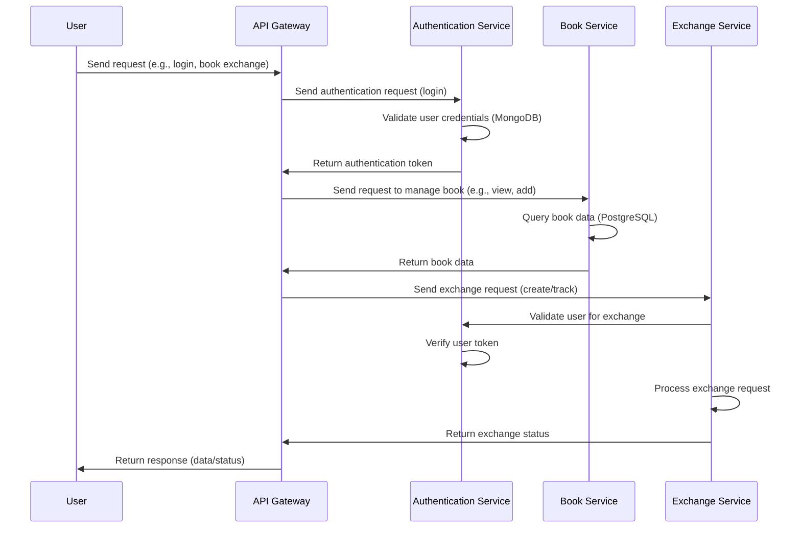

# Microservices Architecture Documentation for Book Exchange Platform

---

## Table of Contents
1. [Introduction](#1-introduction)
2. [Architecture Overview](#2-architecture-overview)
3. [Service Descriptions](#3-service-descriptions)
   - 3.1 [Authentication Service](#31-authentication-service)
   - 3.2 [Book Service](#32-book-service)
   - 3.3 [Exchange Service](#33-exchange-service)
   - 3.4 [API Gateway](#34-api-gateway)
4. [Service Communication Flow](#4-service-communication-flow)
5. [Port Configuration](#5-port-configuration)
6. [Error Handling & Logging](#6-error-handling--logging)
7. [Security Considerations](#7-security-considerations)

---

### 1. Introduction
The Book Exchange Platform is designed as a digital hub that facilitates the lending, borrowing, and exchanging of books between users. By connecting book enthusiasts within a single platform, it promotes sustainable book sharing and community-driven engagement, making books more accessible to everyone.

To create a scalable, flexible, and maintainable platform, we adopted a microservices architecture. This approach segments core functionalities—such as user authentication, book management, and exchange handling—into independent services. Each service is isolated by functionality, allowing it to be developed, deployed, and scaled independently. An API Gateway is employed to provide a unified entry point for all client requests, ensuring that users have a seamless experience interacting with the platform.

The architecture of the Book Exchange Platform is synchronous, with services communicating via HTTP requests. This setup allows for straightforward implementation of business logic without requiring a message broker, making it simpler to manage and deploy. The Authentication Service plays a central role, securing the platform by validating user credentials and tokens for each request.

This document outlines the components of the microservices architecture for the Book Exchange Platform, detailing the responsibilities of each service, the API Gateway configuration, the communication flow, and the strategies implemented for error handling, logging, and security. By adopting this architecture, the platform is well-positioned to handle evolving requirements and increasing demand as the user base grows.

---

### 2. Architecture Overview

The Book Exchange Platform leverages a microservices architecture, where each core functionality—user authentication, book management, and exchange handling—operates independently in its own service. This modular design promotes scalability, maintainability, and separation of concerns, enabling each service to evolve independently.

The architecture consists of the following components:

- **Authentication Service** (Node.js + Express + MongoDB, Port: 3001): This service handles user authentication tasks such as login, registration, and token validation. Built with Node.js and Express, it uses MongoDB as its database to store and manage user data efficiently. MongoDB's flexibility with JSON-like documents allows quick scaling and adjustments to user data, supporting a diverse range of attributes needed for user profiles and authentication.

- **Book Service** (Java + Spring Boot + PostgreSQL, Port: 3002): Developed in Java with Spring Boot, this service manages book-related functionalities like adding, updating, retrieving, and deleting book records. The service utilizes PostgreSQL as its relational database to ensure data integrity and support complex queries on book listings. PostgreSQL’s robustness is ideal for handling structured data like book details, categories, and user interactions related to books.

- **Exchange Service** (Node.js + Express + Sequelize + Postgres, Port: 3003): This service handles book exchange processes, allowing users to initiate, accept, and manage exchange requests. It verifies user identity and manages exchange statuses, ensuring secure and accurate transactions. It relies on the Authentication Service for user verification before processing requests.

- **API Gateway** (Flask + Swagger, Port: 3000): The API Gateway, built with Flask and integrated with Swagger for API documentation, acts as the single entry point for all client requests. It routes incoming traffic to the appropriate microservices (Authentication, Book, or Exchange) and aggregates responses, ensuring a consistent and user-friendly API experience for clients.

**Communication Flow:**  
All services communicate synchronously via HTTP requests, with the API Gateway routing each request to the appropriate service. When authentication is required, services first interact with the Authentication Service to validate user tokens. After successful validation, the requested service processes the business logic. This synchronous communication model ensures simplicity while maintaining security and consistency across the platform.

The use of MongoDB for the Authentication Service and PostgreSQL for the Book Service enables each service to leverage the strengths of the respective databases: MongoDB’s flexibility for user-related data and PostgreSQL’s relational power for structured book information.

This architecture promotes scalability and simplifies maintenance by decoupling each service. It also allows for independent scaling of services based on demand, ensuring the platform can grow with its user base and feature set.

---

### 3. Service Descriptions

#### 3.1 Authentication Service
- **Port:** 3001  
- **Description:** Handles user authentication and authorization for the platform. It serves as a common endpoint for validating user credentials, generating tokens, and managing session data.
- **Endpoints:** List all relevant API endpoints (e.g., `/login`, `/register`, `/validateToken`).
- **Dependencies:** Used by Book and Exchange services to authenticate requests.

#### 3.2 Book Service
- **Port:** 3002  
- **Description:** Manages CRUD operations for book listings. Provides endpoints for adding, updating, retrieving, and deleting book records.
- **Endpoints:** List API endpoints (e.g., `/addBook`, `/updateBook`, `/getBooks`, `/deleteBook`).
- **Dependencies:** Communicates with the Authentication service for user verification.

#### 3.3 Exchange Service
- **Port:** 3003  
- **Description:** Facilitates book exchange functionality, allowing users to initiate, accept, or decline exchange requests.
- **Endpoints:** List API endpoints (e.g., `/requestExchange`, `/acceptExchange`, `/declineExchange`).
- **Dependencies:** Integrates with the Authentication service to verify requests.

#### 3.4 API Gateway
- **Port:** 3000  
- **Description:** Serves as a single point of entry for clients, built with Flask and integrated with Swagger for API documentation.
- **Responsibilities:** Routes requests to the respective services (Authentication, Book, Exchange), aggregates responses, and ensures a consistent API experience.
- **Endpoints:** List primary API routes exposed to clients.
- **Dependencies:** Utilizes each service through synchronous HTTP calls.

---

### 4. Service Communication Flow
Illustrate the request-response workflow among the services. For example:
- **Client Request:** A client makes a request via the API Gateway.
- **Gateway Routing:** API Gateway routes the request to the appropriate service.
- **Authentication Flow:** If authentication is required, the service first contacts the Authentication service for token validation before processing the request.
- **Response Aggregation:** API Gateway collects the responses and forwards them back to the client.

---

### 5. Port Configuration
Outline the port configuration for each service:
- **API Gateway:** 3000
- **Authentication Service:** 3001
- **Book Service:** 3002
- **Exchange Service:** 3003

This setup enables clear separation of services while facilitating debugging and monitoring.

---

### 6. Error Handling & Logging
Discuss the error handling strategies used within each service, including:
- **Standardized Error Responses:** Ensure that each service returns consistent error codes and messages.
- **Logging Mechanism:** Detail the logging setup for tracking errors, requests, and other significant events.

---

### 7. Security Considerations
Outline security practices for the platform, including:
- **Authentication Tokens:** How tokens are generated, validated, and refreshed.
- **Data Encryption:** Briefly describe any encryption used for sensitive data.
- **Access Control:** Explain the role-based access or permissions system (if applicable).

---